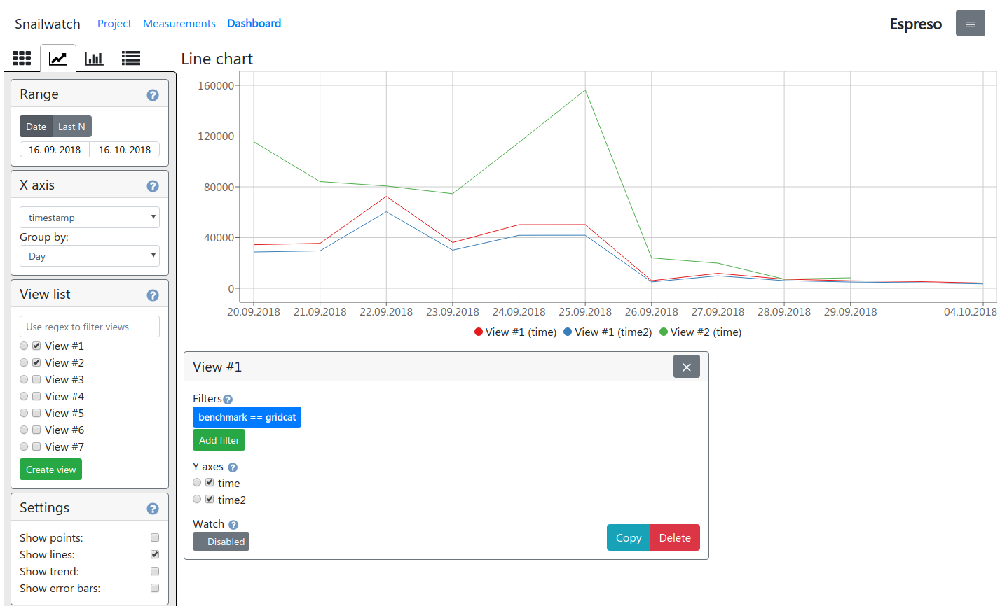
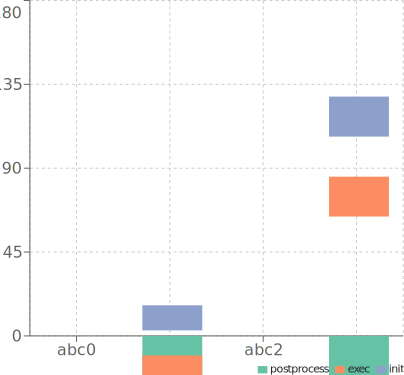

# Snailwatch dashboard
This is a React dashboard for visualising benchmark results
stored in Snailwatch.

We recommend the Docker setup that can be found in the README at the root of the repository.
However if you want to deploy the dashboard manually, you can use the
following commands:

```bash
$ npm install
$ npm start
```

You can find additional information about the dashboard deployment
[here](https://snailwatch.readthedocs.io/en/latest/dashboard-deploy.html).

## Screenshots
**Dashboard overview**


**Bar chart with execution stages**

