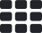
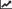
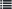

Dashboard
=========
Snailwatch dashboard allows you to manage your projects and measurements and
observe interactive charts displaying your app performance.

This guide describes basic functionality of the dashboard. It assumes that
you are logged in and have selected a project.

Project page
------------
This page contains information about the selected project. Here you can set
the repository URL, commit key and read/revoke the upload token.

*Repository URL* should contain a link to a GitHub/GitLab repository of the project.
It is used to generate direct links to commits in measurement details.

The *commit key* is an attribute of the uploaded measurements that should contain
a string uniquely identifying the commit of the code that was benchmarked.
By default it is set to ``environment.commit``. This field is not required, however
we recommend that you set it properly, because measurements are aggregated by this
key by default in the dashboard.

The *upload* token is required for uploading measurements. If you want to change it,
click on the *Regenerate token* button. The old token will be deleted and a new one
will appear on the page.

Measurements page
-----------------
This page displays a table with the uploaded measurements, by default sorted
from the newest to the oldest. You can display the contents of the individual
measurements and also delete them. There is also an option to export all of
the measurements to a CSV or JSON file.

Dashboard
---------
This is the main page containing various subpages with measurement charts.
In the side menu you can choose a range of measurements to display
(either a date range or the last N measurements).

A central element of querying measurements is a *View*. It
represents a named query containing a selection that filters a subset of the
measurements (``environment.cpus >= 4``) and a projection that chooses what will
be displayed on the Y axis (``init, postprocess``). It also serves as a unit for
detecting regressions (you can setup the detection on a view-by-view basis).

When you upload a measurement containing a previously unseen ``benchmark`` field,
a new *view* with the filter ``benchmark == <...>`` will be created automatically.
You can also create and modify views manually in the line chart and bar chart pages.

|overview| Chart overview
^^^^^^^^^^^^^^^^^^^^^^^^^
The initial subpage contains a grid with previews of individual *views*.
In the side menu you can choose a X axis for the grid and also filter/sort
the displayed views. After clicking on a view preview, you will transition to
the *Line chart*.

|line| Line chart
^^^^^^^^^^^^^^^^^
This subpage displays a line chart for a selected set of views. You can select
the views that you want to see in the side menu's box named *View list*.
There you can also open individual views for editing.

The measurements are aggregated according to the selected *X axis* attribute
and sorted by timestamp. If multiple measurements have the same *X axis* attribute value,
they are grouped together and the chart shows their average value. If you check
the *Show deviation* option in the *Settings* box, the chart will show the min/max
values of those groups.

Upon hovering on a point in the chart, it will also show you how many measurements
are in the given group and what is the standard deviation of their measured values.
If you then click on the point, all of its measurements will appear
in the *Selected measurements* table. There you can inspect them and also
go to their commits if you set up the project's repository URL properly.

|bar| Bar chart
^^^^^^^^^^^^^^^
This subpage is nearly identical to the *Line chart page*, but it displays a
(stacked) bar chart instead of a line chart. In order to prevent mixing unrelated
data together the page will render a separate bar chart for every selected *view*.

|trends| Trends
^^^^^^^^^^^^^^^
Here you can observe changes in your benchmark's performance relative to previous
versions. Measurements are aggregated according to a *Group by* attribute
(selectable in the side menu). Usually you will want to use either the commit ID
or timestamp to group the measurements. The table then displays the measured value
of the most recent group and also how that value changes relative to the previous group
(the *Change* column) and relative to the exponential average of the last 5 groups
(the *Trend* column).

