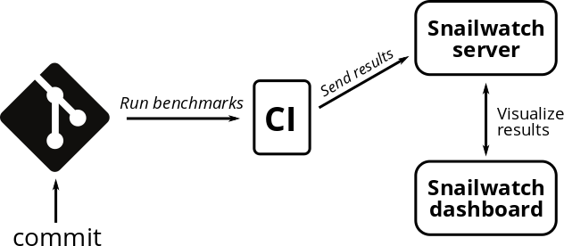

Snailwatch
==========

Snailwatch is a service that collects performance data from your code. It allows you to observe
historical trends of your benchmarks and automatically notifies you if they show signs of performance regressions.
It consists of a server that stores the measured results and a web dashboard that visualizes the measurements.

| To learn more about Snailwatch, read the :doc:`Overview <overview>`.

Complete Snailwatch API documentation can be found :doc:`here <api>`.

.. toctree::
    :maxdepth: 2
    :caption: Usage guide:

    overview
    getting-started
    client
    api

.. toctree::
    :maxdepth: 2
    :caption: Deployment guide:

    deploy-overview
    server-deploy
    dashboard-deploy
